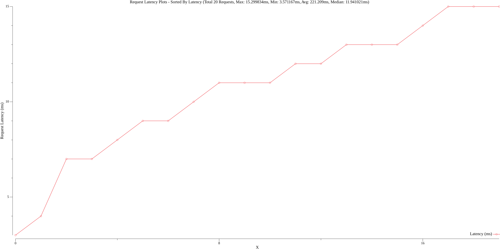
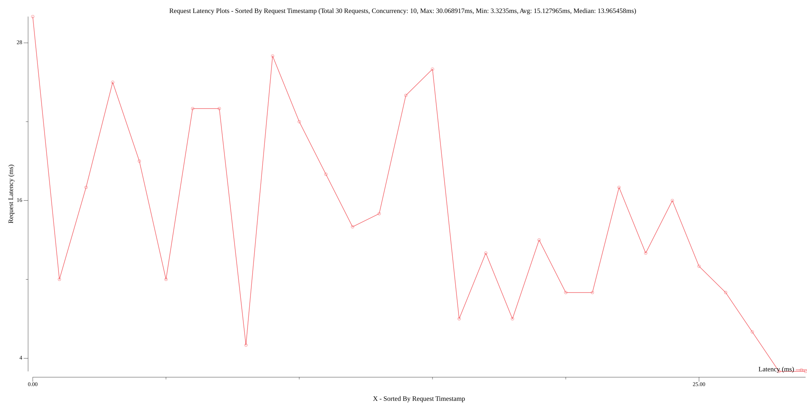

# benchmarker

## Demo

```golang
sendRequest := func(c *http.Client) benchmarker.Result {
    req, err := http.NewRequest(http.MethodGet, "http://localhost:80", nil)
    if err != nil {
        return benchmarker.Result{
            HttpStatus: 0,
            Success:    false,
        }
    }
    r, err := c.Do(req)
    if err != nil {
        return benchmarker.Result{
            HttpStatus: 0,
            Success:    false,
        }
    }
    defer r.Body.Close()

    return benchmarker.Result{
        HttpStatus: r.StatusCode,
        Success:    r.StatusCode == 200,
    }
}
parallel := 10
round := 3
benchmarker.StartBenchmark(parallel, round, sendRequest)
```

## Output

```
Order: 1, Took: 4.803875ms, Success: true, HttpStatus: 200, Extra: map[]
Order: 2, Took: 4.531167ms, Success: true, HttpStatus: 200, Extra: map[]
Order: 3, Took: 2.344125ms, Success: true, HttpStatus: 200, Extra: map[]
Order: 4, Took: 2.041583ms, Success: true, HttpStatus: 200, Extra: map[]
Order: 5, Took: 4.751333ms, Success: true, HttpStatus: 200, Extra: map[]
Order: 6, Took: 3.724709ms, Success: true, HttpStatus: 200, Extra: map[]
Order: 7, Took: 3.980334ms, Success: true, HttpStatus: 200, Extra: map[]
Order: 8, Took: 3.173708ms, Success: true, HttpStatus: 200, Extra: map[]
Order: 9, Took: 3.016166ms, Success: true, HttpStatus: 200, Extra: map[]
Order: 10, Took: 1.4815ms, Success: true, HttpStatus: 200, Extra: map[]
Order: 11, Took: 2.570334ms, Success: true, HttpStatus: 200, Extra: map[]
Order: 12, Took: 3.305875ms, Success: true, HttpStatus: 200, Extra: map[]
Order: 13, Took: 2.181625ms, Success: true, HttpStatus: 200, Extra: map[]
Order: 14, Took: 1.228916ms, Success: true, HttpStatus: 200, Extra: map[]
Order: 15, Took: 1.304166ms, Success: true, HttpStatus: 200, Extra: map[]
Order: 16, Took: 2.35775ms, Success: true, HttpStatus: 200, Extra: map[]
Order: 17, Took: 3.149417ms, Success: true, HttpStatus: 200, Extra: map[]
Order: 18, Took: 782.917µs, Success: true, HttpStatus: 200, Extra: map[]
Order: 19, Took: 1.90025ms, Success: true, HttpStatus: 200, Extra: map[]
Order: 20, Took: 2.904ms, Success: true, HttpStatus: 200, Extra: map[]

-------------------------------

total: 20
min: 782.917µs
max: 4.803875ms
median: 2.737167ms
avg: 2.776687ms
status_count: map[200:20]
success_count: map[true:20]
Generated plot graph: plots_sorted_by_request_order.png
Generated plot graph: plots_sorted_by_latency.png
```

## Plots

`plots_sorted_by_latency.png`




`plots_sorted_by_request_order.png`

