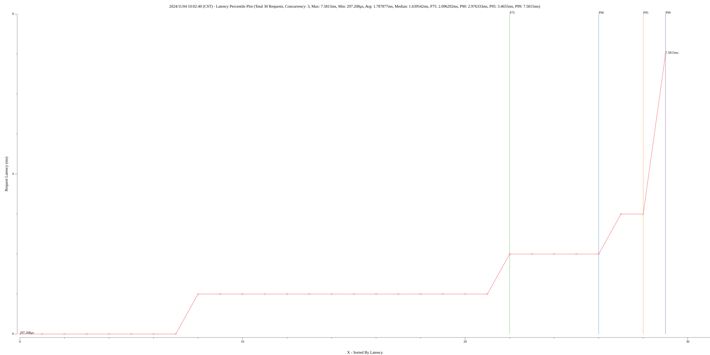
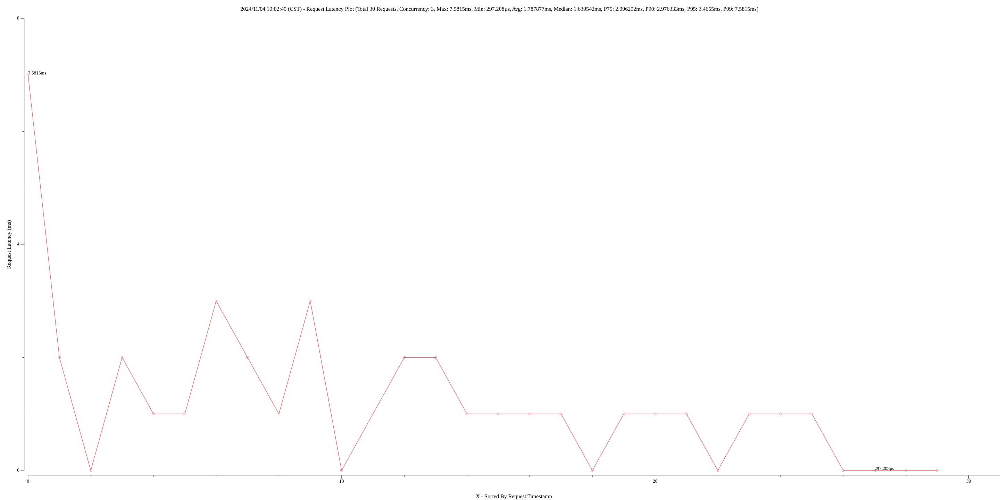
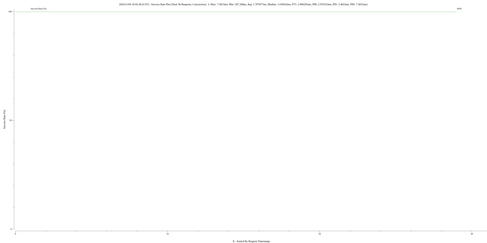

# benchmarker

Simple benchmarker written in go.

## Demo

```golang
func TestStartBenchmark(t *testing.T) {
	_, _, _ = benchmarker.StartBenchmark(benchmarker.BenchmarkSpec{
		Concurrent: 3,
		Round:      10,
		BuildReqFunc: func() (*http.Request, error) {
			return http.NewRequest(http.MethodGet, "http://localhost:8080", nil)
		},
	})
}
```

If you need CLI support:

```golang
//   -conc int
//         Concurrency (default 1)
//   -concgroup string
//         Concurrency Groups (e.g., '1,30,50', is equivalent to running the benchmark three times with concurrency 1, 30 and 50)
//   -debug
//         Enable debug log
//   -dur duration
//         Duration
//   -round int
//         Round (default 2)
func main() {
	_, err := benchmarker.StartBenchmarkCli(benchmarker.BenchmarkSpec{
		BuildReqFunc: func() (*http.Request, error) {
			return http.NewRequest(http.MethodGet, "http://localhost:8080", nil)
		},
	})
	if err != nil {
		panic(err)
	}
}

// concurrency 3, duration 10 seconds
// go run main.go -dur 10s -conc 3
```

## Output

```
Benchmark Time: 2024/11/04 10:02:40 (CST)

--------- Brief ---------------

total_time: 19.330292ms
total_requests: 30
throughput: 1552 req/sec
concurrency: 3
rounds (for each worker): 10
status_count: map[200:30]
success_count: map[true:30]

--------- Latency -------------

min: 297.208µs
max: 7.5815ms
median: 1.639542ms
avg: 1.787877ms
P75: 2.096292ms
P90: 2.976333ms
P95: 3.4655ms
P99: 7.5815ms

--------- Data ----------------

data file: benchmark_records.txt

-------------------------------

Timestamp: 1730685760316608, Took: 7.5815ms, Success: true (100.00%), HttpStatus: 200, Extra: map[]
Timestamp: 1730685760316629, Took: 2.976333ms, Success: true (100.00%), HttpStatus: 200, Extra: map[]
Timestamp: 1730685760316649, Took: 850.584µs, Success: true (100.00%), HttpStatus: 200, Extra: map[]
Timestamp: 1730685760317501, Took: 2.607125ms, Success: true (100.00%), HttpStatus: 200, Extra: map[]
Timestamp: 1730685760319606, Took: 1.073083ms, Success: true (100.00%), HttpStatus: 200, Extra: map[]
Timestamp: 1730685760320109, Took: 1.7545ms, Success: true (100.00%), HttpStatus: 200, Extra: map[]
Timestamp: 1730685760320680, Took: 3.4045ms, Success: true (100.00%), HttpStatus: 200, Extra: map[]
Timestamp: 1730685760321864, Took: 2.914584ms, Success: true (100.00%), HttpStatus: 200, Extra: map[]
Timestamp: 1730685760324085, Took: 1.837791ms, Success: true (100.00%), HttpStatus: 200, Extra: map[]
Timestamp: 1730685760324190, Took: 3.4655ms, Success: true (100.00%), HttpStatus: 200, Extra: map[]
Timestamp: 1730685760324779, Took: 454.208µs, Success: true (100.00%), HttpStatus: 200, Extra: map[]
Timestamp: 1730685760325233, Took: 1.886625ms, Success: true (100.00%), HttpStatus: 200, Extra: map[]
Timestamp: 1730685760325924, Took: 2.74725ms, Success: true (100.00%), HttpStatus: 200, Extra: map[]
Timestamp: 1730685760327120, Took: 2.096292ms, Success: true (100.00%), HttpStatus: 200, Extra: map[]
Timestamp: 1730685760327655, Took: 1.800208ms, Success: true (100.00%), HttpStatus: 200, Extra: map[]
Timestamp: 1730685760328672, Took: 1.266667ms, Success: true (100.00%), HttpStatus: 200, Extra: map[]
Timestamp: 1730685760329217, Took: 1.027958ms, Success: true (100.00%), HttpStatus: 200, Extra: map[]
Timestamp: 1730685760329456, Took: 1.121542ms, Success: true (100.00%), HttpStatus: 200, Extra: map[]
Timestamp: 1730685760329938, Took: 940.25µs, Success: true (100.00%), HttpStatus: 200, Extra: map[]
Timestamp: 1730685760330245, Took: 1.696792ms, Success: true (100.00%), HttpStatus: 200, Extra: map[]
Timestamp: 1730685760330578, Took: 1.404125ms, Success: true (100.00%), HttpStatus: 200, Extra: map[]
Timestamp: 1730685760330879, Took: 1.582292ms, Success: true (100.00%), HttpStatus: 200, Extra: map[]
Timestamp: 1730685760331942, Took: 638.625µs, Success: true (100.00%), HttpStatus: 200, Extra: map[]
Timestamp: 1730685760331982, Took: 1.978917ms, Success: true (100.00%), HttpStatus: 200, Extra: map[]
Timestamp: 1730685760332462, Took: 1.826042ms, Success: true (100.00%), HttpStatus: 200, Extra: map[]
Timestamp: 1730685760333961, Took: 1.069208ms, Success: true (100.00%), HttpStatus: 200, Extra: map[]
Timestamp: 1730685760334288, Took: 736.417µs, Success: true (100.00%), HttpStatus: 200, Extra: map[]
Timestamp: 1730685760335031, Took: 297.208µs, Success: true (100.00%), HttpStatus: 200, Extra: map[]
Timestamp: 1730685760335328, Took: 301.833µs, Success: true (100.00%), HttpStatus: 200, Extra: map[]
Timestamp: 1730685760335630, Took: 298.375µs, Success: true (100.00%), HttpStatus: 200, Extra: map[]
```

## Plots

`plot_sorted_by_latency.png`



`plot_sorted_by_request_order.png`



`plot_success_rate.png`


